

  <ins><b>💻 ALGORITHMS & DATA STRUCTURES</b></ins>

<h1 align="center">
  🌳 SECCIÓN II: LA ARQUITECTURA DE LOS ÁRBOLES
</h1>

  <code>🧬 Dominando las estructuras conexas, acíclicas y sus ramificaciones 🧬</code>

<blockquote>
  
<b>"Un árbol es la armonía perfecta del grafo: sin ciclos, sin retornos, donde cada nodo encuentra su único camino hacia la raíz."</b>

</blockquote>

---

## 1. Definiciones Fundamentales
Un **árbol** es un grafo conexo y acíclico.
*   **Conexo:** Existe un camino entre cualquier par de vértices.
*   **Acíclico:** No contiene ciclos ni circuitos.
*   **Bosque:** Grafo acíclico pero no conexo (conjunto de árboles).
---

### A. Árbol (Conexo y Acíclico)
*   **Propiedad:** Es un solo bloque integrado (conexo) donde es imposible hacer un recorrido cerrado (acíclico). Existe exactamente un único camino entre cualquier par de nodos.

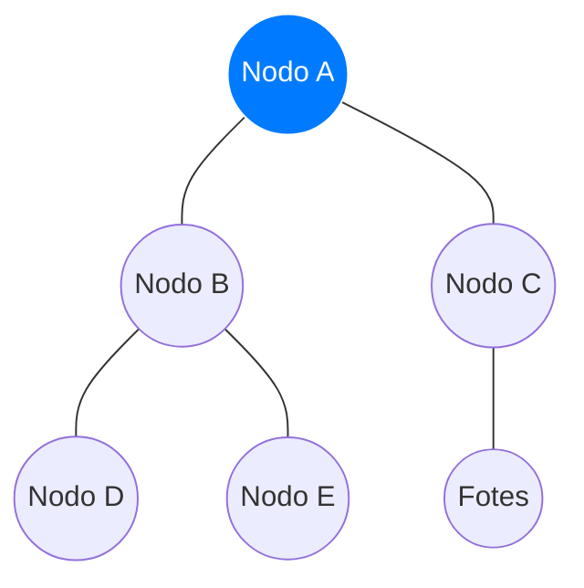

---

### B. Bosque (Acíclico pero No Conexo)
*   **Propiedad:** Colección de múltiples árboles independientes y aislados entre sí. Cada subgrupo cumple de forma individual la condición de no tener ciclos.

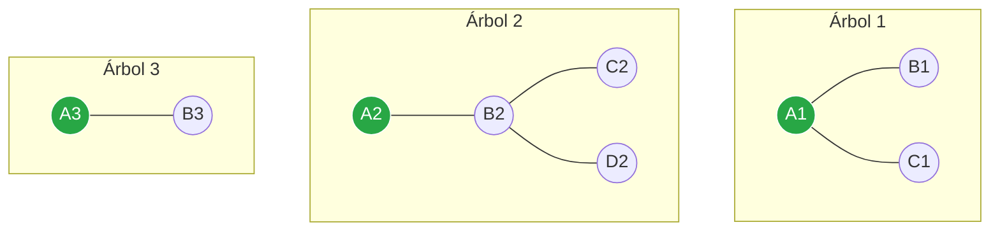

---

### C. Clasificador de Estructuras (Árbol, Bosque o Grafo General)
Diagrama de flujo interactivo para identificar rápidamente el tipo de estructura según sus conexiones y ciclos.

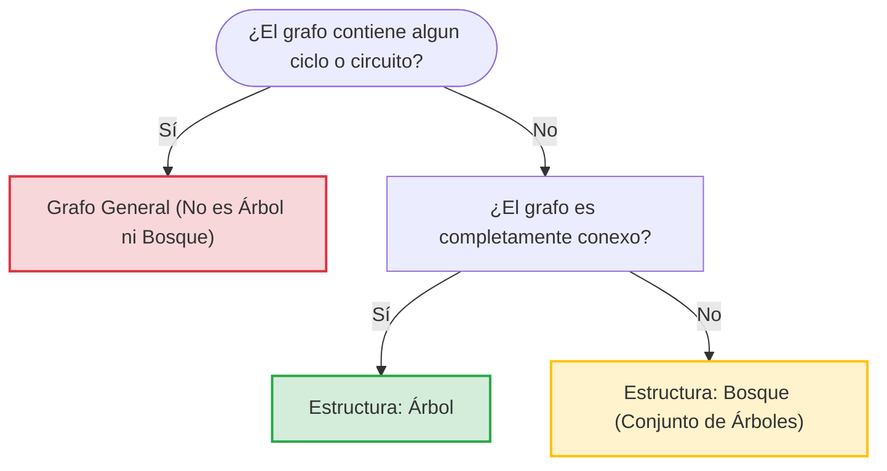

---

## 2. Propiedades Matemáticas
Para un grafo con $n$ vértices:
*   **Aristas:** Tiene exactamente $n - 1$ aristas.
*   **Caminos Únicos:** Existe un único camino simple entre cualquier par de nodos.
*   **Hojas:** Todo árbol con $n \ge 2$ tiene al menos dos vértices de grado 1.
*   **Conectividad Mínima:** Quitar cualquier arista desconceta el grafo.
---

El siguiente ejemplo utiliza un árbol con **$n = 5$ vértices**. Al aplicar las propiedades, se demuestra matemáticamente su estructura rígida.

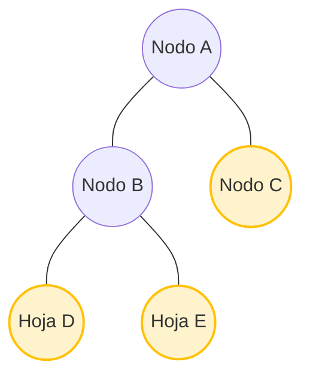

### Demostración Visual de las Propiedades:
1. **Relación Vértices-Aristas:** Como hay $n = 5$ nodos, el árbol tiene exactamente **4 aristas** ($n - 1$). Si añades una línea más entre C y D, rompes la regla y creas un ciclo.
2. **Caminos Únicos:** Para ir del nodo **C** al **E**, solo existe la ruta única `C -> A -> B -> E`. No hay alternativas.
3. **Vértices Hoja:** Los nodos **C, D y E** tienen grado 1 (solo una conexión), cumpliendo la regla de tener al menos dos hojas.
4. **Conectividad Mínima:** Si borras la arista entre **A** y **B**, el grafo se rompe instantáneamente en dos partes aisladas.

---

## 3. Árboles Enraizados y Jerarquía
Tienen un nodo fijo llamado **raíz** (nivel 0). Establecen relaciones jerárquicas:
*   **Padre / Hijo:** Nodos superiores e inferiores directamente conectados.
*   **Hermanos:** Nodos con el mismo padre.
*   **Ancestros / Descendientes:** Nodos en la ruta hacia la raíz / nodos derivados.
*   **Altura:** Nivel máximo que alcanza una hoja.
*   **Árbol $m$-ario:** Cada nodo interno tiene como máximo $m$ hijos (completo si tiene exactamente $m$).
*   **Árbol Binario:** Caso donde $m = 2$ (hijo izquierdo e hijo derecho).
---

El siguiente diagrama muestra un **Árbol Binario ($m = 2$)** estructurado por niveles. Las etiquetas a la izquierda indican la profundidad y ayudan a medir la altura total.

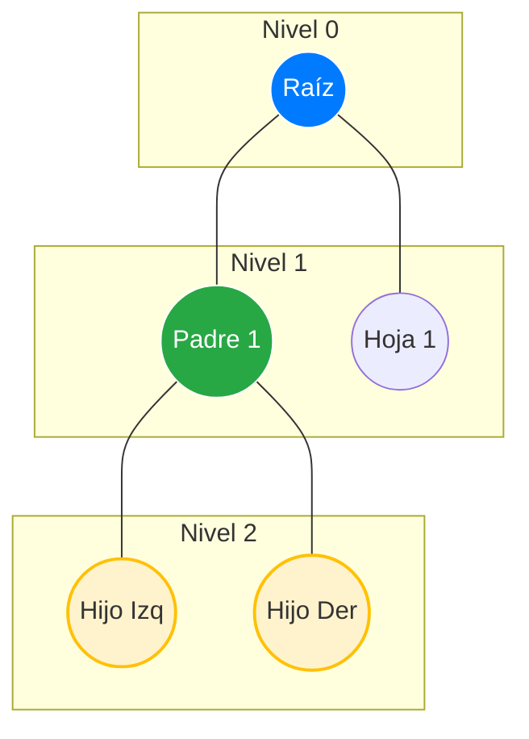

### Guía de Lectura del Gráfico:
*   **Raíz:** El nodo azul superior (origen del árbol, nivel 0).
*   **Padre / Hijo:** El nodo **Padre 1** es hijo de la Raíz, y a su vez es padre de **Hijo Izq** e **Hijo Der**.
*   **Hermanos:** **Hijo Izq** e **Hijo Der** son hermanos porque comparten el mismo padre.
*   **Ancestros:** Los ancestros de **Hijo Izq** son **Padre 1** y la **Raíz**.
*   **Altura del Árbol:** Es **2**, ya que el nivel máximo alcanzado por las hojas más profundas es el Nivel 2.

---

## 4. Aplicaciones en Computación
*   **Árboles de Búsqueda Binaria (BST):** Búsquedas rápidas en tiempo logarítmico $O(\log n)$.
*   **Sistemas de Archivos:** Organización de directorios y carpetas (raíz `C:` o `/`).
*   **Árboles de Expresión:** Evaluación y análisis sintáctico de operaciones en compiladores.
*   **Spanning Tree Protocol (STP):** Desactiva enlaces redundantes en redes para evitar bucles.
*   **Compresión de Datos:** Reducción de espacio mediante códigos variables (Huffman).
---

El siguiente mapa conceptual interactivo conecta cada concepto teórico de los árboles con su implementación directa en la infraestructura tecnológica actual.

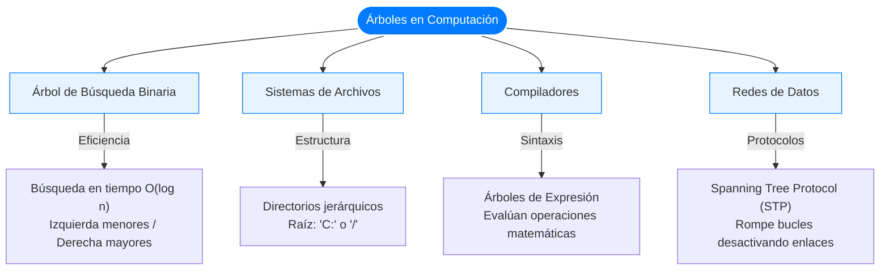

### Ejemplo Visual: Estructura de un BST (Búsqueda Binaria)
Para entender el concepto logarítmico, nota cómo los números menores van a la izquierda y los mayores a la derecha:

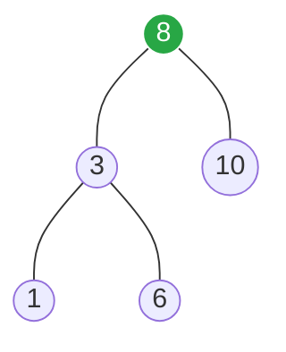

---

## 5. Métricas de Eficiencia (Longitud de Paseo)
*   **Interna ($I$):** Suma de los niveles de todos los nodos internos.
*   **Externa ($E$):** Suma de los niveles de todos los nodos hoja.
*   **Teorema Binario:** En árboles binarios con $n$ nodos internos: $E = I + 2n$.
*   **Ponderada ($W$):** $W = \sum w_i \cdot l_i$, donde $w_i$ es el peso (frecuencia) y $l_i$ el nivel de la hoja. Optimizar implica minimizar $W$.
---

El siguiente gráfico representa un árbol binario con **$n = 2$ nodos internos** (Azules) y **3 nodos hoja** (Amarillos). Las líneas horizontales marcan el nivel (profundidad) para realizar el cálculo matemático.

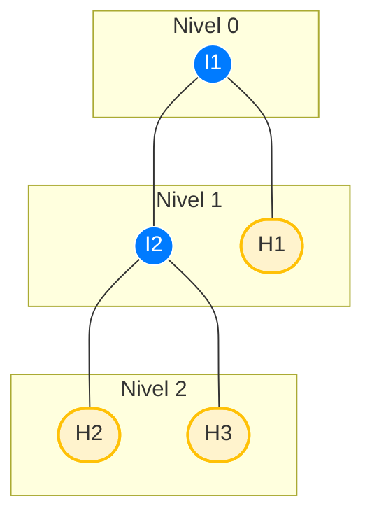

### Demostración de las Fórmulas con el Gráfico:

1. **Longitud de Paseo Interna ($I$):** Suma de niveles de nodos internos (Azules).
   * Nodo $I_1$ (Nivel 0) + Nodo $I_2$ (Nivel 1) $\rightarrow$ **$I = 0 + 1 = 1$**

2. **Longitud de Paseo Extrema ($E$):** Suma de niveles de nodos hoja (Amarillos).
   * Hoja $H_1$ (Nivel 1) + Hoja $H_2$ (Nivel 2) + Hoja $H_3$ (Nivel 2) $\rightarrow$ **$E = 1 + 2 + 2 = 5$**

3. **Verificación del Teorema Binario ($E = I + 2n$):**
   * Sabiendo que tenemos $n = 2$ nodos internos:
   * $5 = 1 + 2(2) \rightarrow 5 = 1 + 4 \rightarrow \mathbf{5 = 5}$ (¡Se cumple estrictamente!)

4. **Longitud Ponderada ($W$):** Si las hojas tuvieran pesos (frecuencias), multiplicarías el nivel de cada hoja por su peso asignado. Optimizar la estructura consiste en subir las hojas más pesadas a los niveles más cercanos a la raíz (Nivel 0 o 1) para que la suma total $W$ sea lo menor posible.

---

## 6. Códigos de Prefijos y de Huffman
*   **Código de Prefijo:** Ninguna palabra clave es prefijo de otra. Permite decodificación instantánea.
*   **Algoritmo de Huffman:** Compresión sin pérdida que minimiza la longitud ponderada ($W$).
*   **Construcción:** 
    1. Introduce los caracteres en una cola de prioridad según su frecuencia.
    2. Combina iterativamente los dos nodos de menor peso en un nuevo nodo padre con la suma de sus frecuencias.
    3. Al quedar un solo nodo (raíz), asigna `0` a la izquierda y `1` a la derecha *(Texto interrumpido en el original)* para definir los códigos binarios.
ión y eliminación es **$O(\log n)$**.
*   **El Problema de la Degeneración (Peor Caso):** Si los datos se insertan en orden estrictamente ascendente (ej. 1, 2, 3, 4), el árbol pierde su estructura ramificada y se convierte en una lista enlazada lineal. En este estado "degenereado", la altura del árbol pasa a ser $n$ y la complejidad de las operaciones colapsa a un ineficiente **$O(n)$**. Esto justifica la existencia de variantes auto-balanceables como los árboles AVL o Rojo-Negro.
---

### A. Árbol de Huffman y Código de Prefijos
*   **Concepto:** Las hojas contienen los caracteres con sus frecuencias (pesos). Caminar a la izquierda añade un `0` y a la derecha un `1`. 
*   **Propiedad de Prefijo:** Nota cómo ningún código es prefijo de otro (ej. **A** es `0`, por ende ningún otro carácter empieza con `0`). Esto permite una decodificación instantánea.

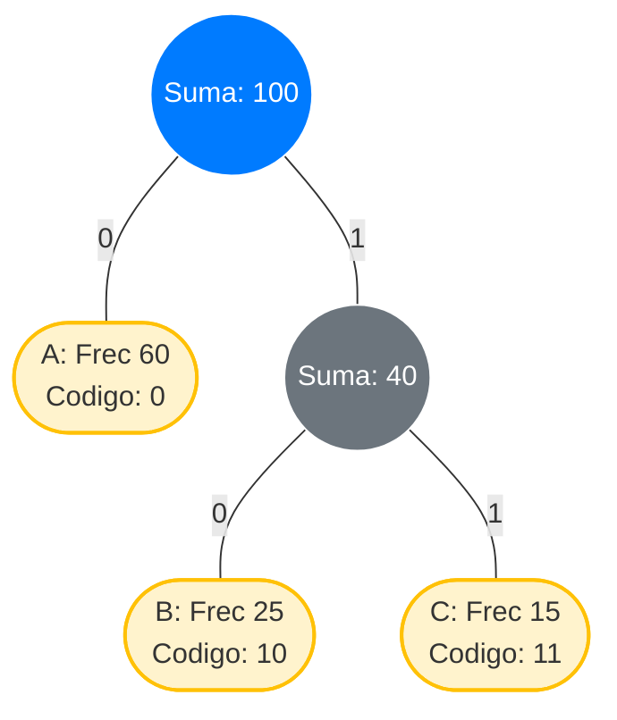

---

### B. El Problema de la Degeneración en un BST (Peor Caso)
*   **Árbol Balanceado (Caso Óptimo):** Altura mínima, operaciones eficientes en **$O(\log n)$**.
*   **Árbol Degenerado (Peor Caso):** Ocurre al insertar datos ordenados (ej. `1 -> 2 -> 3`). El árbol colapsa en una lista lineal perdiendo su eficiencia, obligando a las operaciones a degradarse a un lento **$O(n)$**.

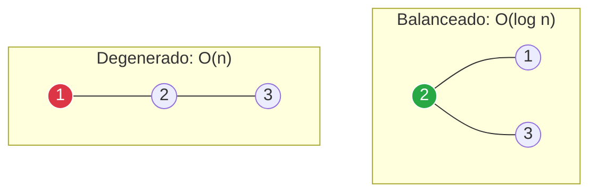
---
### C. Flujo del Algoritmo de Huffman
Diagrama de bloques interactivo que describe los tres pasos fundamentales para construir el árbol de compresión óptimo de abajo hacia arriba (*bottom-up*).

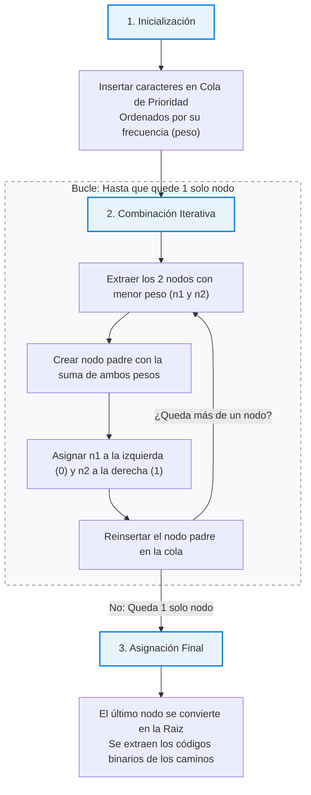
---
## 🛠️ Portafolio de Evidencias: Aplicación Práctica de Árboles 

Este apartado consolida el registro de las actividades prácticas, experimentales y autónomas desarrolladas durante el periodo académico en la asignatura de Matemáticas Discretas, evidenciando el dominio de la teoría de redes.

### 🗣️ 1. Componente ACD (Aprendizaje en Contacto con el Docente)
Actividades de sustentación, defensa oral de algoritmos y talleres evaluados directamente por el docente en el aula de clase.

### **[[Ver Anexo de Evidencias ACD (Google Drive)](https://drive.google.com/file/d/1NKiRL1j69vhgDJOBi51B1QERwMDbgqKS/view?usp=drive_link)]**
---

### 🧪 2. Componente APE (Aprendizaje Práctico-Experimental)
Resolución de problemas de aplicación práctica y experimentación guiada para afianzar los conceptos de la unidad.
### **[[Ver Anexo de Evidencias APE (Google Drive)](https://drive.google.com/file/d/1WzvZxiSU1S0dxQh8eG6xpxblI0tVM0-q/view?usp=drive_link)]**

---

### 📝 3. Componente AA (Aprendizaje Autónomo)
Trabajos de investigación individual y resolución de bancos de problemas desarrollados de forma independiente.

### **[[Ver Anexo de Evidencias AA (Google Drive)](https://drive.google.com/file/d/19eXYlnZPGy06rBJ35N3-s1Y5TXp_a2k-/view?usp=drive_link))]**
  

 

  <!-- Botón Regresar a Grafos -->
  
  &nbsp;&nbsp;
  <!-- Botón Inicio Portada -->
  

 

