# TEORÍA DE GRAFOS 

## 1. Anatomía y Representación de un Grafo
Un **grafo conecta vértices (nodos) mediante aristas (arcos)** para modelar redes y relaciones.

* **Grado:** Número de conexiones de un vértice.
* **Direccionalidad:** Puede ser no dirigido (bidireccional) o dirigido (unidireccional).
* **Diagramas:** Representación geométrica tradicional mediante nodos y líneas.
* **Matriz de Adyacencia:** Cuadrícula matemática binaria (1 y 0). Ideal para grafos densos.
* **Lista de Adyacencia:** Lista compacta de vecinos directos. Eficiente en memoria para grafos dispersos.

---

### a. Diaggrama de Nodos y Enlaces (Grafo No Dirigido)
Representación geométrica tradicional. El **Nodo B** actúa como el puente principal (influencer) con el mayor **grado** de la red.

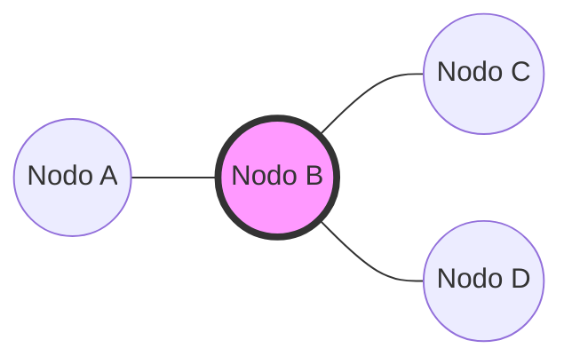

---

### b. Direccionalidad (Grafo Dirigido / Unidireccional)
Representación donde las relaciones tienen un sentido único (flechas).

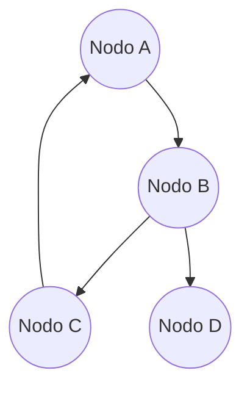

---

### c. Matriz de Adyacencia (Representación Estructural)
Cuadrícula matemática binaria. El siguiente diagrama mapea de forma visual cómo se estructuran los `1` (conexión) y `0` (sin conexión) en la memoria.
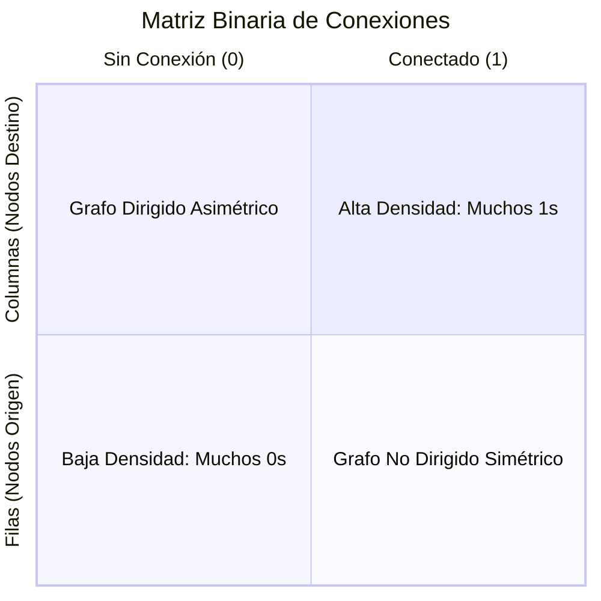
---

### d. Lista de Adyacencia (Estructura Compacta)
Formato de lista ideal para ahorrar memoria en grafos dispersos, mostrando únicamente los vecinos directos.

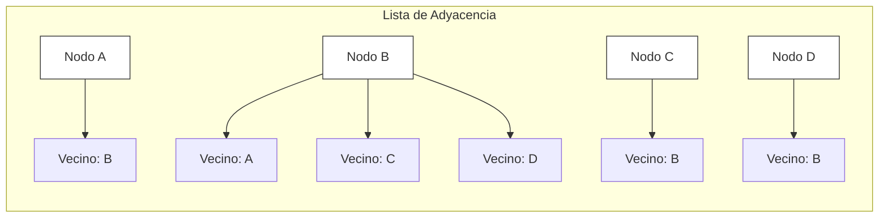
---

## 2. Caminos vs. Circuitos (Visualización de Rutas)

Para los siguientes ejemplos, utilizaremos un grafo de 4 nodos conectados en anillo con una diagonal interna. Las líneas gruesas y de colores representan el recorrido realizado.

### A. Paseo (Walk)
*   **Regla:** Movimiento libre. Permite repetir nodos y líneas.
*   **Ejemplo de Ruta:** `A -> B -> C -> B -> A`. (Repite el nodo **B** y las aristas entre ellos).

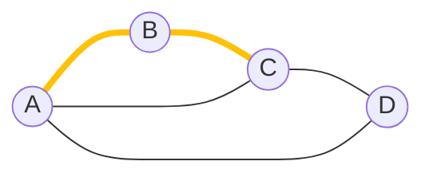

---

### B. Camino (Path)
*   **Regla:** Recorrido con restricciones estrictas. Todos los vértices y aristas deben ser únicos.
*   **Ejemplo de Ruta:** `A -> B -> C -> D`. (No repite absolutamente nada).

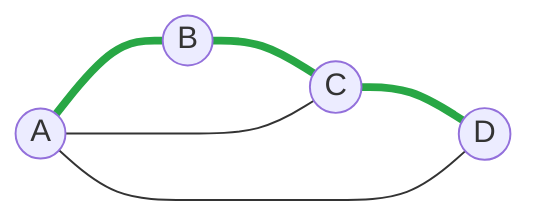

---

### C. Circuito (Cycle)
*   **Regla:** Viaje redondo. Es un camino cerrado que empieza y termina en el mismo nodo, sin repetir elementos intermedios.
*   **Ejemplo de Ruta:** `A -> B -> C -> A`. (Regresa limpiamente al origen).

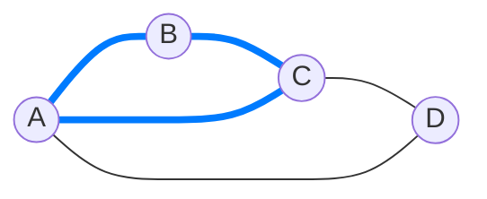

---

### D. Árbol de Decisión Comercial: ¿Qué recorrido necesitas?
Diagrama interactivo para clasificar el tipo de movimiento en la red según tus restricciones.

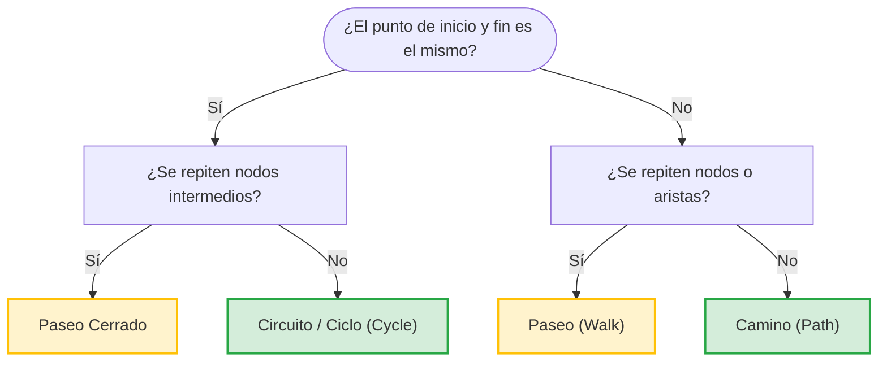
---

## 3. Exploración por Aristas: Enfoque de Euler

### A. Paseo de Euler (Camino Euleriano)
*   **Regla:** Pasa por todas las aristas una vez y termina en un nodo diferente al de inicio.
*   **Condición:** Exactamente **dos vértices impares** (los nodos **A** y **D** tienen grado 3). El recorrido válido es: `A -> B -> C -> D -> B -> A -> D`.

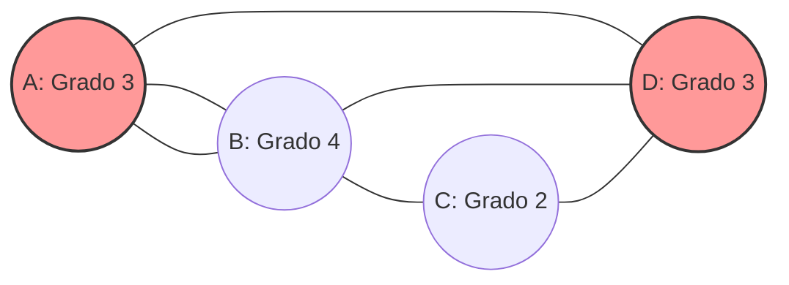

---

### B. Circuito de Euler (Ciclo Euleriano)
*   **Regla:** Pasa por todas las aristas una vez y regresa exactamente al nodo de origen.
*   **Condición:** **Todos los vértices son pares** (todos tienen grado 2 o 4). Un recorrido válido empezando en A es: `A -> B -> C -> D -> B -> A`.

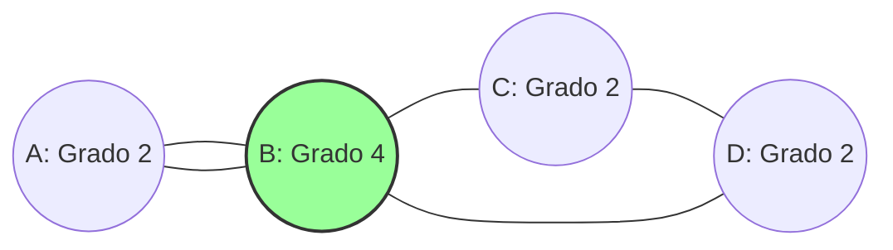

---

### C. Criterio de Decisión de Euler
Diagrama de flujo interactivo para saber rápidamente qué tipo de recorrido euleriano posee un grafo según el grado de sus nodos.

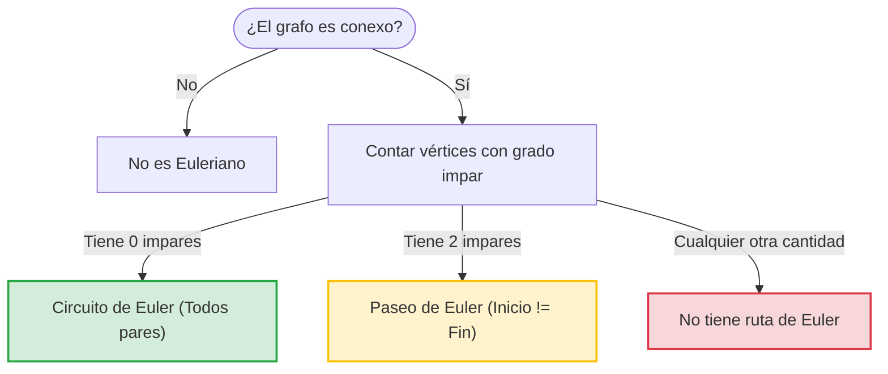
---
## 4. Exploración por Nodos: Enfoque de Hamilton
El objetivo es visitar cada vértice **exactamente una vez**, ignorando si quedan aristas libres.

* **Paseo de Hamilton:** Visita todos los nodos una vez. El punto final es distinto al inicial.
* **Circuito de Hamilton:** Visita todos los nodos una vez y regresa limpiamente al origen. Es un problema NP-completo (sin teorema definitivo de existencia).
* **Teorema de Dirac:** Garantiza circuito si cada nodo tiene un grado $\ge n/2$ (donde $n \ge 3$ es el número de vértices).
* **Teorema de Ore:** Garantiza circuito si la suma de grados de cualquier par de vértices no adyacentes es $\ge n$.

### A. Paseo de Hamilton (Camino Hamiltoniano)
*   **Regla:** Visita todos los vértices exactamente una vez. Pueden quedar aristas sin usar y el inicio es diferente al fin.
*   **Ejemplo de Ruta:** `A -> B -> C -> D`. (Todos los nodos tocados una sola vez).

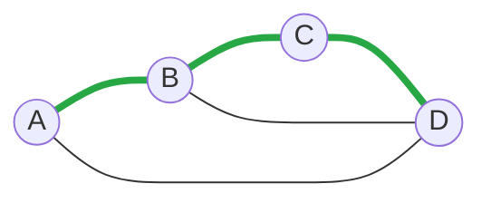

---

### B. Circuito de Hamilton (Ciclo Hamiltoniano)
*   **Regla:** Visita todos los vértices exactamente una vez y regresa limpiamente al origen.
*   **Ejemplo de Ruta:** `A -> B -> C -> D -> A`. (Viaje redondo perfecto por todos los nodos).

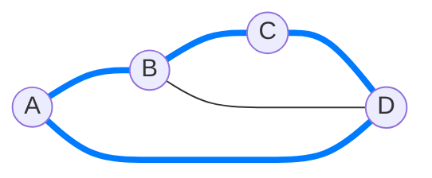

---

### C. Teoremas de Suficiencia (Dirac y Ore)
Mapa conceptual interactivo para verificar si un grafo denso tiene garantizado un Circuito de Hamilton según las condiciones analíticas de sus grados.

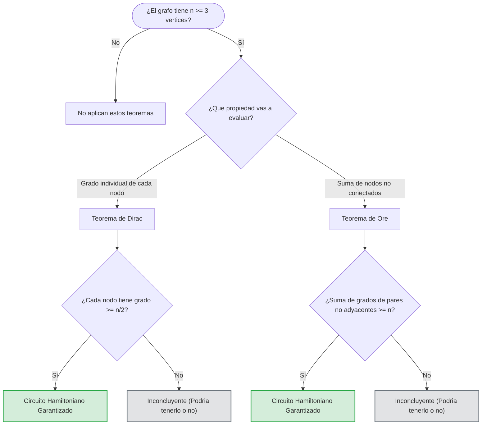

---

## 5. Análisis y Optimización de Algoritmos
La optimización evita la fuerza bruta y reduce la complejidad temporal de exponencial $O(2^n)$ a polinomial $O(n^2)$, ahorrando memoria y CPU.

* **Algoritmo de Fleury (Euler):** Construye rutas eulerianas con la regla de **no cruzar una arista de corte (puente)** a menos que sea la única opción. Complejidad clásica: $O(|E|^2)$, donde $|E|$ es el número de aristas.
* **Algoritmo de Dijkstra (Camino corto):** *(Texto interrumpido en el original)*. Diseñado para hallar la ruta de menor costo o distancia desde un nodo origen hacia los demás.

### A. Algoritmo de Fleury (Evitando Aristas de Corte / Puentes)
*   **Concepto:** La arista que une **B** y **C** es un puente (arista de corte). Si la cruzas muy pronto, aíslas el resto del grafo y la ruta falla. Fleury obliga a consumir primero los ciclos locales antes de cruzarla.

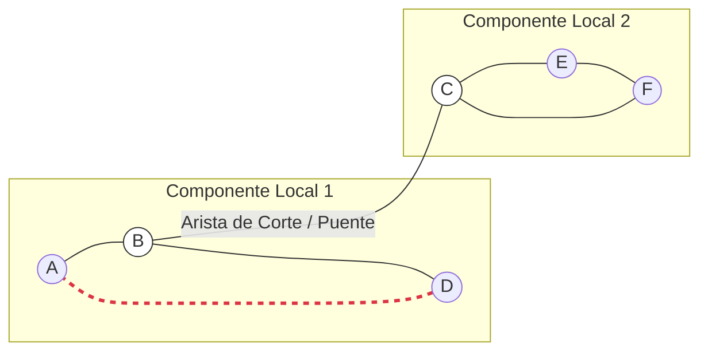

---

### B. Algoritmo de Dijkstra (Camino Más Corto)
*   **Concepto:** Encuentra la ruta con menor peso acumulado desde un origen (Nodo A). Las etiquetas en las flechas representan el costo o distancia entre los nodos.

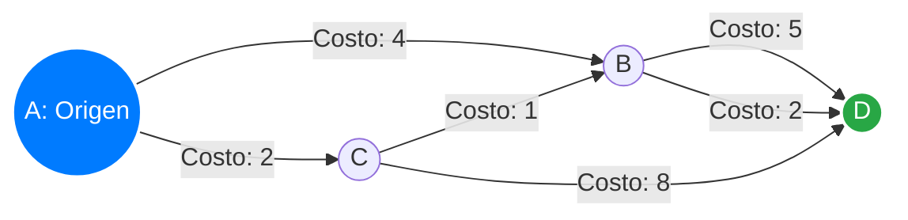

---

### C. Flujo de Operación del Algoritmo de Dijkstra
Diagrama secuencial que muestra cómo procesa la optimización el algoritmo paso a paso en la memoria del computador.

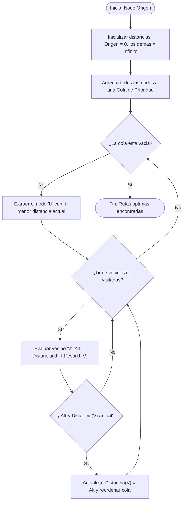
---
---

## 🛠️ Portafolio de Evidencias: Aplicación Práctica de Grafos

Este apartado consolida el registro de las actividades prácticas, experimentales y autónomas desarrolladas durante el periodo académico en la asignatura de Matemáticas Discretas, evidenciando el dominio de la teoría de redes.

### 🗣️ 1. Componente ACD (Aprendizaje en Contacto con el Docente)
Actividades de sustentación, defensa oral de algoritmos y talleres evaluados directamente por el docente en el aula de clase.

### **[[Ver Anexo de Evidencias ACD (Google Drive)](https://drive.google.com/drive/folders/1aealLI-3X5CfW4aXvX3w6P1LhF1_UCdP?usp=drive_link)]**
---

### 🧪 2. Componente APE (Aprendizaje Práctico-Experimental)
Resolución de problemas de aplicación práctica y experimentación guiada para afianzar los conceptos de la unidad.
### **[[Ver Anexo de Evidencias APE (Google Drive)](https://drive.google.com/file/d/1PFhss0oNnzJ-ke0ivNAFkKTM8WBmW_fl/view?usp=drive_link)]**

---

### 📝 3. Componente AA (Aprendizaje Autónomo)
Trabajos de investigación individual y resolución de bancos de problemas desarrollados de forma independiente.

### **[[Ver Anexo de Evidencias AA (Google Drive)](https://drive.google.com/drive/folders/1CmSQdFvxGMDTbyjSQ9BxKOvArl7nofpB?usp=drive_link)]**
